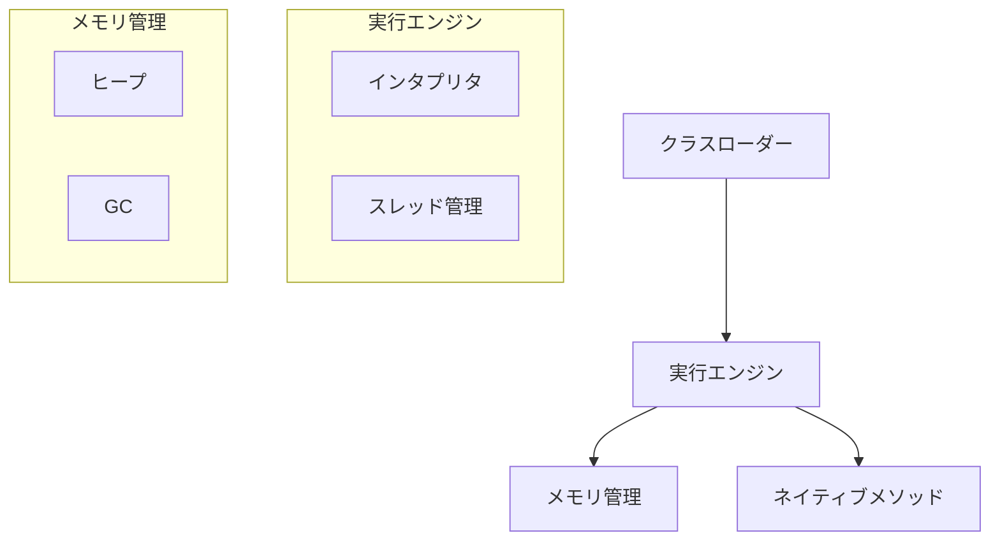
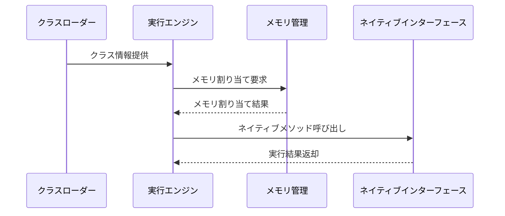

# アーキテクチャ設計

## 1. 全体アーキテクチャ

## 2. 主要コンポーネント

### 2.1 クラスローダー
- クラスファイルの読み込みと解析
- バイトコードの検証
- クラス情報の管理

### 2.2 実行エンジン
- バイトコード実行の中核コンポーネント
- インタプリタによる命令実行
- スレッド管理（シングルスレッド）

### 2.3 メモリ管理
- ヒープ領域の管理
- オブジェクトのライフサイクル管理
- ガベージコレクション

### 2.4 ネイティブメソッド
- JNIの基本的な実装
- システムコールのハンドリング

## 3. コンポーネント間の相互作用

## 4. 設計原則

### 4.1 モジュール性
- 各コンポーネントは明確な責務を持つ
- 疎結合な設計を心がける
- インターフェースを通じた通信

### 4.2 拡張性
- 将来的な機能追加を考慮
- プラグイン的な拡張機構の検討
- バージョンアップへの対応

### 4.3 テスト容易性
- 各コンポーネントの単体テスト
- 統合テストの実施
- モック/スタブの活用

## 5. 技術スタック

### 5.1 開発言語・フレームワーク
- Java 17
- Gradle
- JUnit 5

### 5.2 開発ツール
- チェックスタイル
- SpotBugs
- JaCoCo

## 6. セキュリティ設計

### 6.1 実行時の安全性
- セキュリティマネージャーの実装
- アクセス制御の実装方針
- リソース使用制限の方針