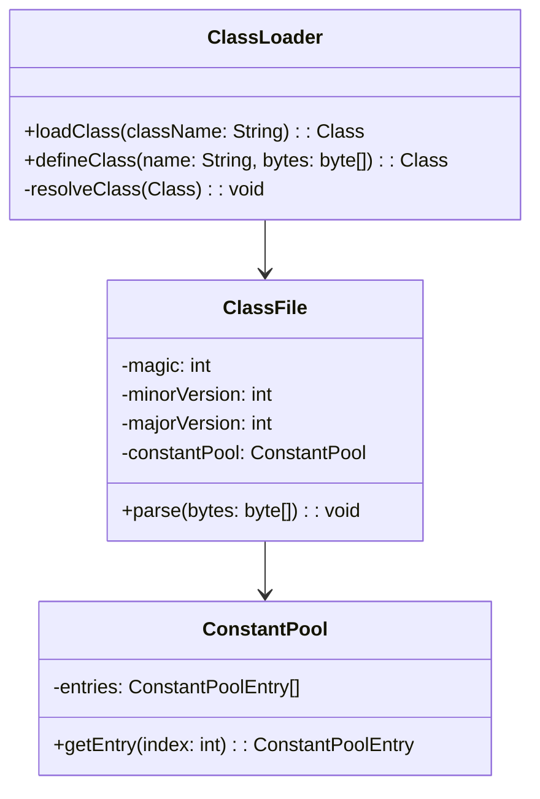
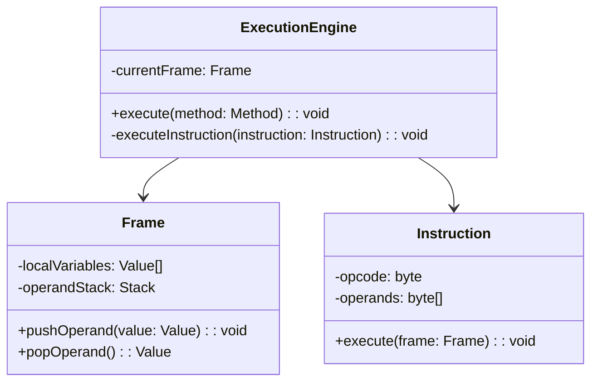
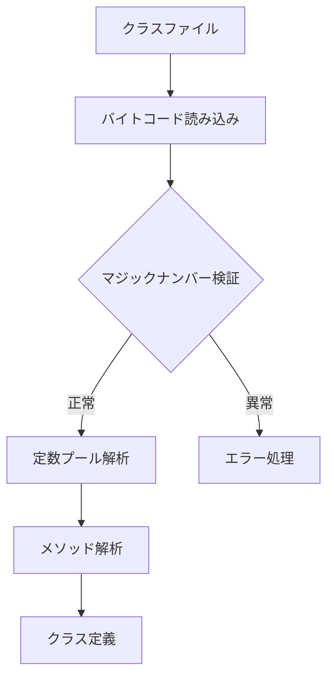
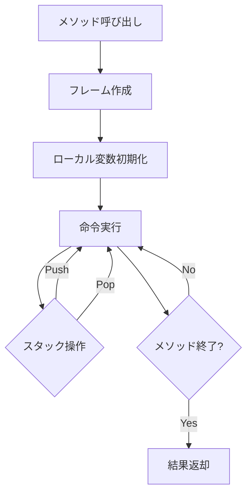
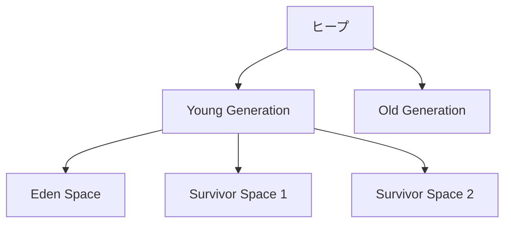
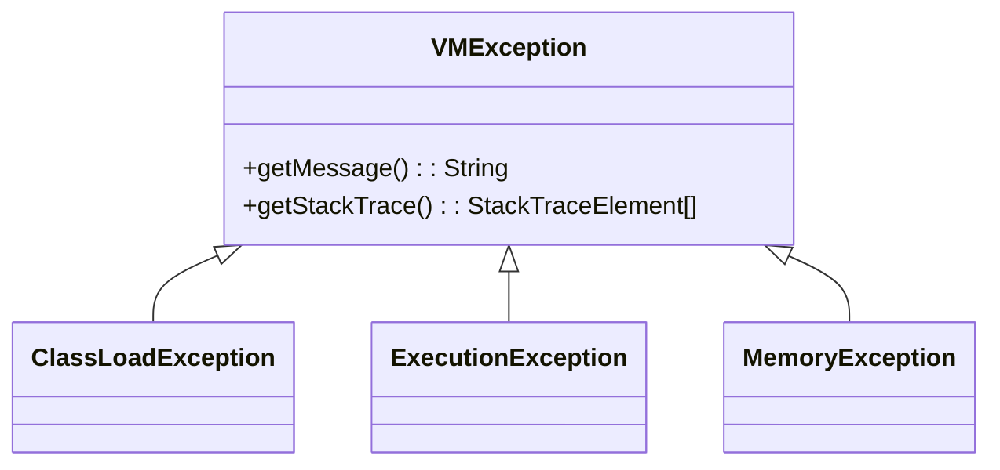
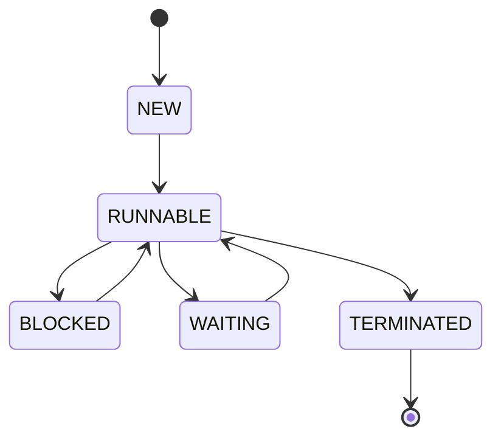

# システム設計詳細

## 1. クラス構造

### 1.1 クラスローダーサブシステム



### 1.2 実行エンジンサブシステム



## 2. データフロー

### 2.1 クラスロード処理



### 2.2 メソッド実行フロー



## 3. メモリ構造

### 3.1 ヒープ領域



### 3.2 オブジェクトレイアウト

```
+-------------------+
| Object Header     |
+-------------------+
| Class Pointer     |
+-------------------+
| Fields           |
|                   |
+-------------------+
```

## 4. エラー処理

### 4.1 例外階層



## 5. 状態管理

### 5.1 スレッド状態遷移



## 6. 設計の制約事項

### 6.1 メモリ制約
- ヒープサイズの動的調整
- GCのタイミング制御
- メモリリーク防止策

### 6.2 パフォーマンス制約
- 命令実行のオーバーヘッド最小化
- メモリアクセスの効率化
- スレッド切り替えコストの考慮