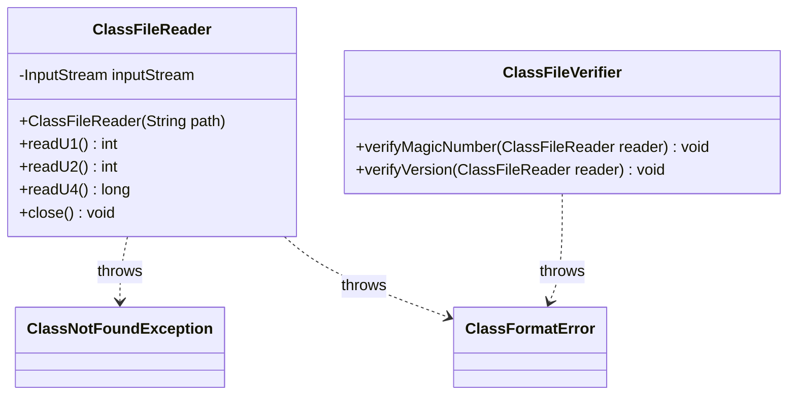

# クラスローダー実装計画

## フェーズ1.1: クラスファイル基本読み込み実装計画

### クラス構造

### 実装ステップ

1. **ファイル読み取り基本機能** (Current)
   - [x] プロジェクト構造のセットアップ
   - [ ] ClassFileReaderの基本実装
   - [ ] ファイル存在チェックのテスト実装
   - [ ] テストが失敗することを確認（Red）
   - [ ] 最小限の実装
   - [ ] テスト成功の確認（Green）

2. **基本データ型読み取り**
   - [ ] u1読み取りテストの実装
   - [ ] u2読み取りテストの実装
   - [ ] u4読み取りテストの実装
   - [ ] 各データ型の境界値テスト
   - [ ] エラー処理のテスト

3. **検証機能**
   - [ ] ClassFileVerifierの実装
   - [ ] マジックナンバー検証
   - [ ] バージョン情報検証

### テスト計画

1. **ClassFileReaderTest**
   - `testFileNotFound()`: ファイルが存在しない場合
   - `testFileNotReadable()`: 読み取り権限がない場合
   - `testFileTooLarge()`: ファイルサイズ制限
   - `testEmptyClassFile()`: 空ファイル
   - `testDirectoryAsClassFile()`: ディレクトリ指定

2. **データ型読み取りテスト**
   - `testReadU1()`
   - `testReadU2()`
   - `testReadU4()`
   - それぞれの境界値テスト

3. **ClassFileVerifierTest**
   - `testValidMagicNumber()`
   - `testInvalidMagicNumber()`
   - バージョン検証テスト

### 品質基準
- テストカバレッジ100%
- すべてのエッジケースのテスト
- 明確なエラーメッセージ
- コードスタイルガイドライン遵守