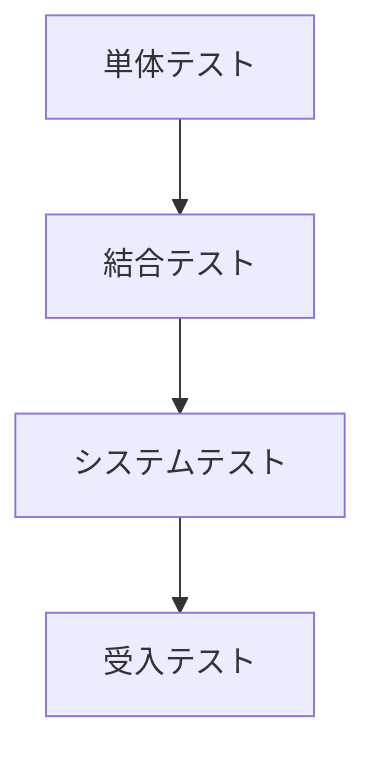

# テスト戦略

## 1. テスト方針

### 1.1 概要
このプロジェクトでは、以下の原則に基づいてテストを実施します：

- テストファーストの開発アプローチ
- 高いテストカバレッジの維持（目標: 80%以上）
- 自動テストの活用
- 継続的なテスト実行（CI環境での自動実行）

### 1.2 テストレベル

## 2. テスト分類

### 2.1 単体テスト（Unit Test）
- 各クラスの独立したテスト
- JUnit 5を使用
- モック/スタブの活用（Mockitoを使用）

#### テスト対象
- クラスローダー
- バイトコード処理
- メモリ管理
- 実行エンジン各コンポーネント

### 2.2 結合テスト（Integration Test）
- コンポーネント間の連携テスト
- エンドツーエンドのシナリオテスト

#### テスト対象
- クラスロード〜実行までの一連の流れ
- メモリ管理とGCの連携
- ネイティブインターフェースの連携

### 2.3 システムテスト
- システム全体の機能テスト
- パフォーマンステスト
- 負荷テスト

#### テスト対象
- 実際のJavaプログラムの実行
- エラー処理と回復
- リソース使用状況

## 3. テスト自動化

### 3.1 CI/CDパイプライン

### 3.2 自動化ツール
- JUnit 5: テストフレームワーク
- Mockito: モックフレームワーク
- JaCoCo: コードカバレッジ
- SpotBugs: バグ検出
- Checkstyle: コード規約チェック

## 4. テスト環境

### 4.1 必要環境
- JDK 17以上
- Gradle 8.x
- CI環境（GitHub Actions）

### 4.2 テストデータ
- サンプルJavaクラスファイル
- テスト用バイトコード
- 異常系テストケース

## 5. テスト計画

### 5.1 フェーズ1: 基本機能
- クラスローダーのテスト
- 基本命令セットのテスト
- メモリ管理の基本機能テスト

### 5.2 フェーズ2: 拡張機能
- 完全な命令セットのテスト
- GCの動作テスト
- エラー処理のテスト

### 5.3 フェーズ3: 総合テスト
- 実際のアプリケーション実行テスト
- パフォーマンステスト
- 長期安定性テスト

## 6. 品質メトリクス

### 6.1 カバレッジ目標
- ライン網羅率: 80%以上
- 分岐網羅率: 75%以上
- メソッド網羅率: 90%以上

### 6.2 その他の指標
- テスト成功率: 100%
- 静的解析での警告: 0件
- 重大なバグ: 0件

## 7. レポーティング

### 7.1 テスト結果の報告
- テスト実行結果
- カバレッジレポート
- 静的解析レポート

### 7.2 品質管理
- バグトラッキング
- 改善計画の立案
- 定期的なレビュー実施