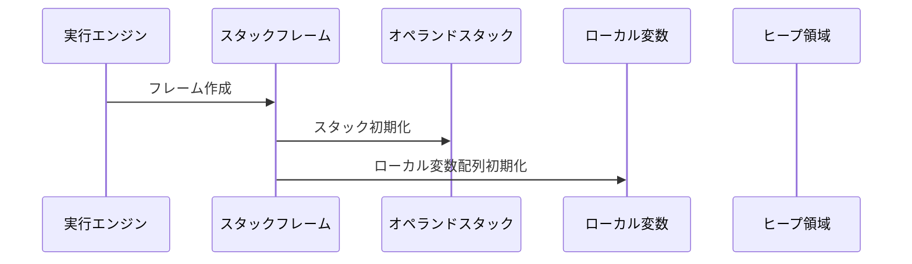
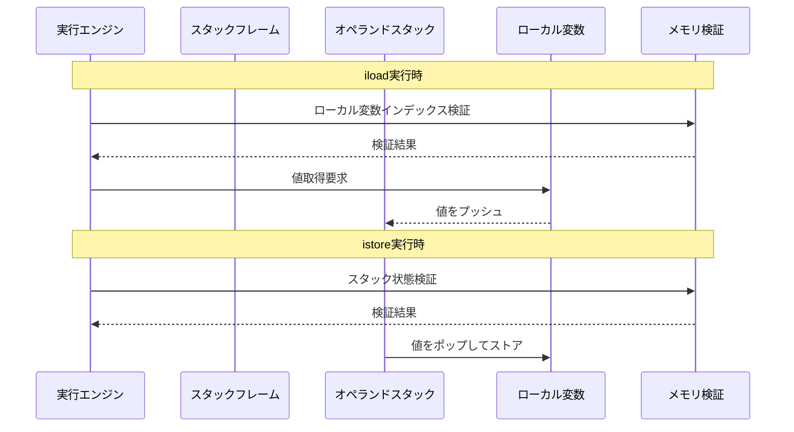
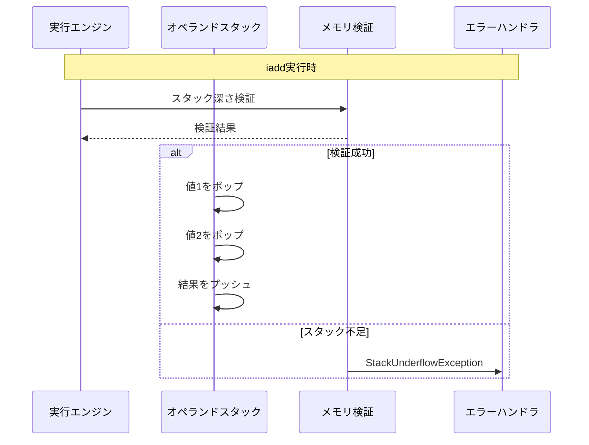
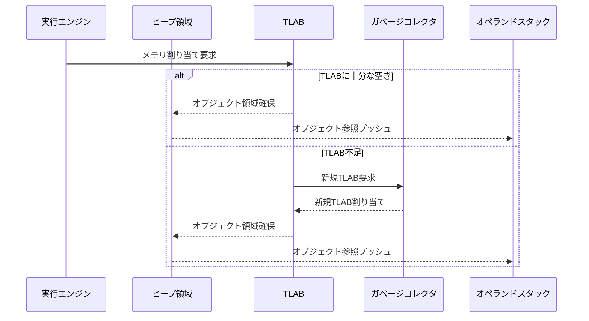
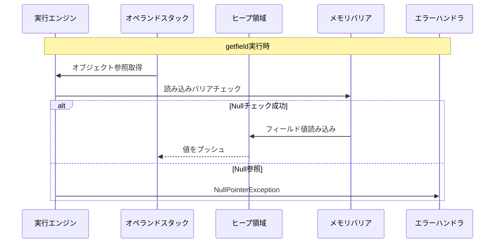
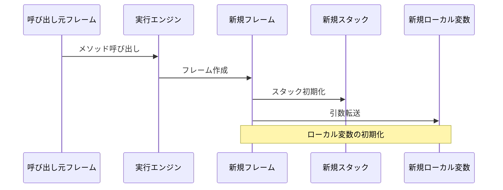
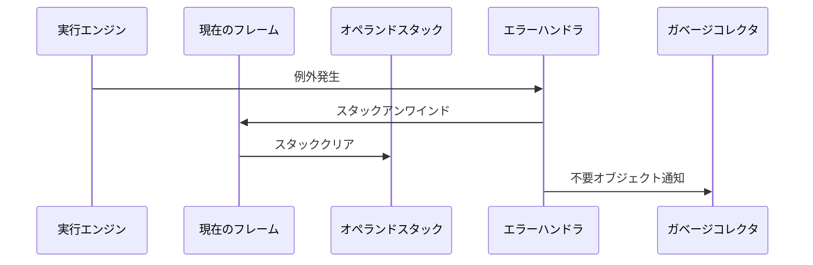

# バイトコード実行時のメモリ操作シーケンス

## 基本的なメモリ操作フロー

## ロード/ストア命令のメモリ操作

## 算術演算命令のメモリ操作

## オブジェクト生成時のメモリ操作

## フィールドアクセス時のメモリ操作

## メソッド呼び出し時のメモリ操作

## エラー発生時のメモリ回復

## メモリ安全性の確保メカニズム

### 実行時チェック
1. **スタック操作前の検証**
   - スタックオーバーフロー/アンダーフロー
   - 型の整合性
   - null参照

2. **ヒープアクセス時の検証**
   - オブジェクト境界
   - アクセス権限
   - 世代間参照

### メモリバリア
1. **書き込みバリア**
   - 世代間参照の追跡
   - 参照カウント更新
   - 並行GC用の同期

2. **読み込みバリア**
   - オブジェクト移動の追跡
   - 参照の整合性確保

## 実装上の注意点

### パフォーマンス最適化
1. **メモリアクセスパターン**
   - ホットパスの特定
   - キャッシュ効率の向上
   - メモリ階層の活用

2. **バリアコスト**
   - 必要最小限のチェック
   - インライン展開
   - 条件分岐の最適化

### スレッドセーフティ
1. **同期ポイント**
   - メモリ操作の原子性
   - ロック粒度の最適化
   - デッドロック防止

2. **可視性保証**
   - メモリフェンス
   - volatile意味論
   - happens-before関係

### エラー回復
1. **状態の一貫性**
   - トランザクション的な更新
   - ロールバック機構
   - クリーンアップ処理

2. **リソース解放**
   - 確実な解放
   - 循環参照の処理
   - 一時オブジェクトの管理