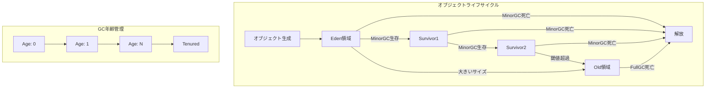
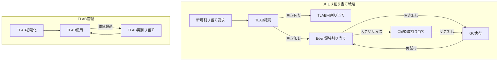
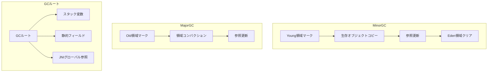
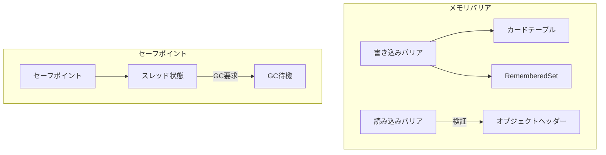
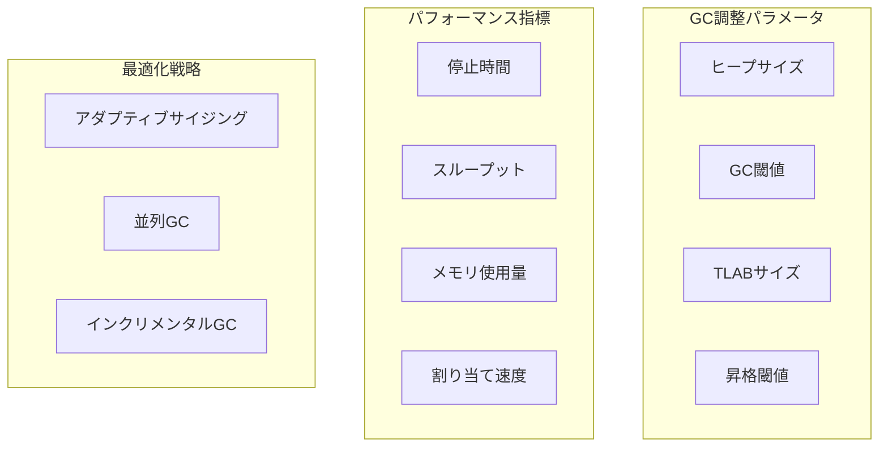

# メモリ管理とガベージコレクションの詳細関係

## オブジェクトのライフサイクルと世代別GC

## メモリ割り当てと解放の戦略

## ガベージコレクションプロセス

## メモリバリアとセーフポイント

## GC調整とパフォーマンス

## 実装上の注意点

### オブジェクト配置の最適化
- **オブジェクトの配置**: 関連するオブジェクトを近くに配置
- **メモリアライメント**: キャッシュライン境界に合わせた配置
- **フラグメンテーション対策**: コンパクション戦略の適用

### GCチューニング
- **ヒープサイズ**: アプリケーションの特性に応じた適切なサイズ設定
- **GC頻度**: 処理負荷とメモリ効率のバランス
- **昇格閾値**: オブジェクトの寿命分布に基づく設定

### スレッドセーフティ
- **同期ポイント**: GC実行時の安全な停止位置の確保
- **参照更新**: 安全な参照の更新メカニズム
- **メモリバリア**: 世代間参照の追跡

### パフォーマンスモニタリング
- **GCログ**: GC実行の詳細な記録
- **メモリ使用状況**: 各領域のメモリ使用量の追跡
- **スループット**: アプリケーション実行時間の測定