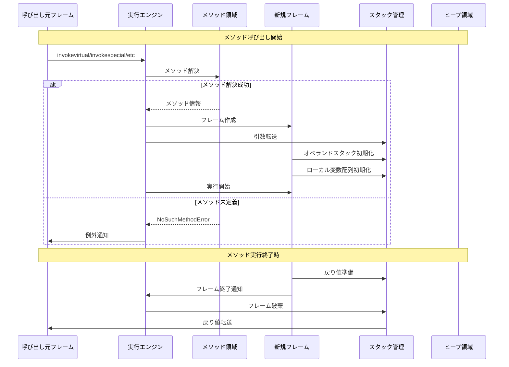
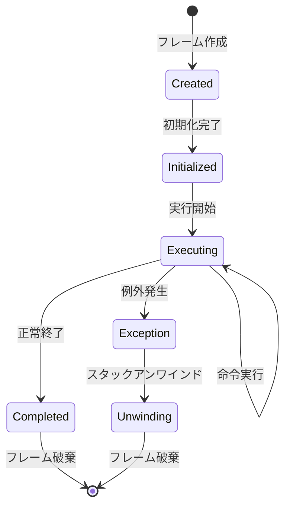
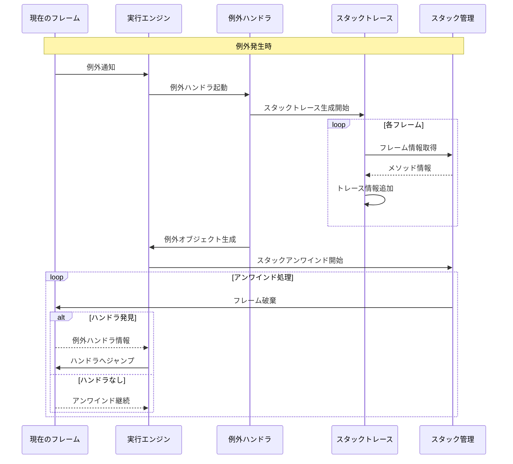

# メソッド呼び出しとスタックフレーム管理

## メソッド呼び出しのライフサイクル



## スタックフレームの状態遷移



## 例外処理とスタックトレース



## フレーム管理の実装詳細

### フレーム構造
1. **基本情報**
   - 実行メソッド参照
   - プログラムカウンタ
   - フレームタイプ（通常/ネイティブ）

2. **実行環境**
   - オペランドスタック
   - ローカル変数配列
   - 定数プールへの参照

3. **状態管理**
   - 実行状態フラグ
   - 同期状態
   - モニタ情報

### メモリレイアウト
```
+------------------------+
| フレームヘッダ         |
|------------------------|
| 定数プール参照         |
|------------------------|
| メソッド情報           |
|------------------------|
| ローカル変数配列       |
|------------------------|
| オペランドスタック     |
+------------------------+
```

### スレッドセーフティ
1. **フレームの独立性**
   - スレッドローカルなフレームスタック
   - フレーム間の参照制御
   - 同期化されたメソッドの処理

2. **状態の一貫性**
   - アトミックな状態遷移
   - メモリバリアの適用
   - ロック管理

### パフォーマンス最適化
1. **フレーム割り当て**
   - フレームプール
   - スレッドローカルキャッシュ
   - サイズ予測

2. **アクセス最適化**
   - ホットメソッドの特別扱い
   - インライン化の考慮
   - エスケープ解析

## 実装上の注意点

### スタック管理
1. **深さ制限**
   - 最大深さの設定
   - 再帰呼び出しの制御
   - スタックオーバーフロー検出

2. **メモリ効率**
   - フレームサイズの最適化
   - 不要領域の即時解放
   - メモリ断片化の防止

### 例外処理
1. **パフォーマンス考慮**
   - 例外パスの最適化
   - スタックトレース生成の遅延
   - キャッシュの活用

2. **正確性保証**
   - フレーム情報の完全性
   - 例外チェーンの維持
   - リソースの確実な解放

### デバッグサポート
1. **フレーム情報**
   - ソースファイル情報
   - 行番号マッピング
   - ローカル変数名

2. **モニタリング**
   - フレーム使用統計
   - メモリ使用状況
   - パフォーマンス指標