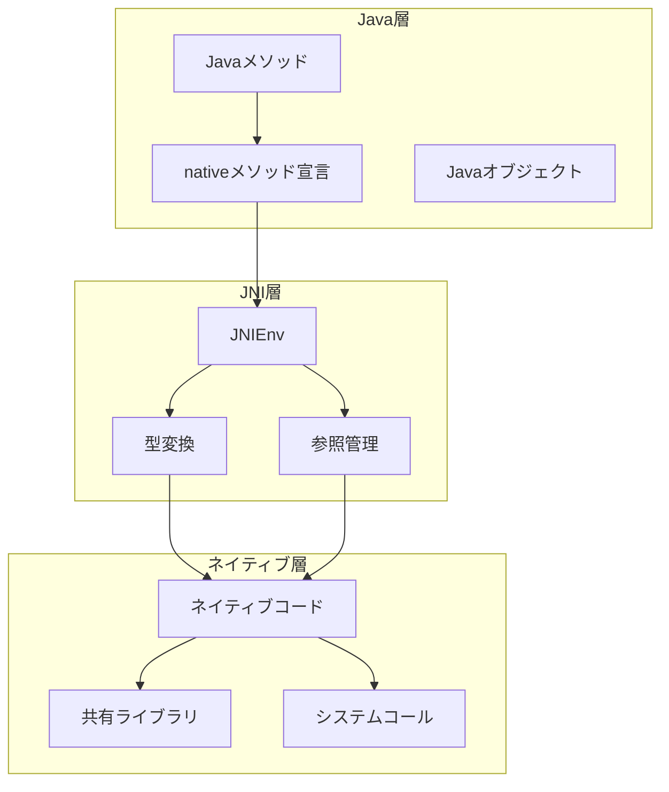
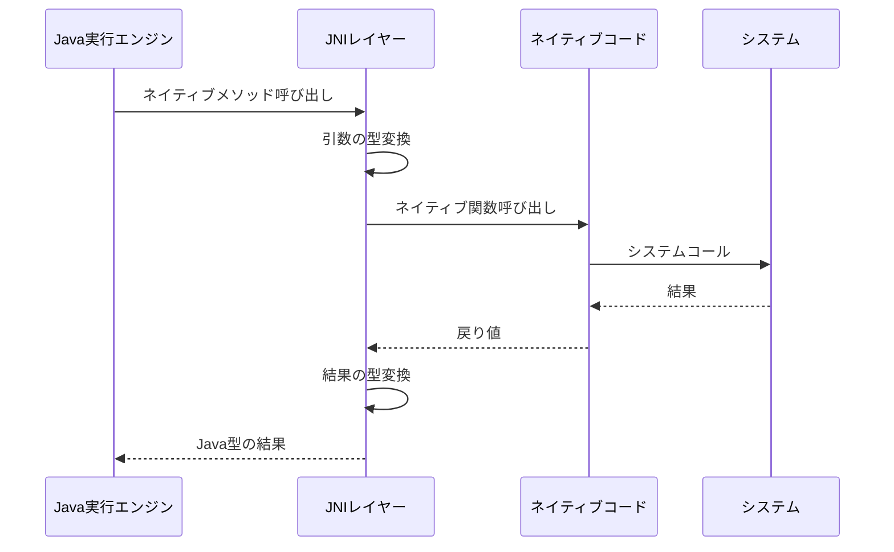
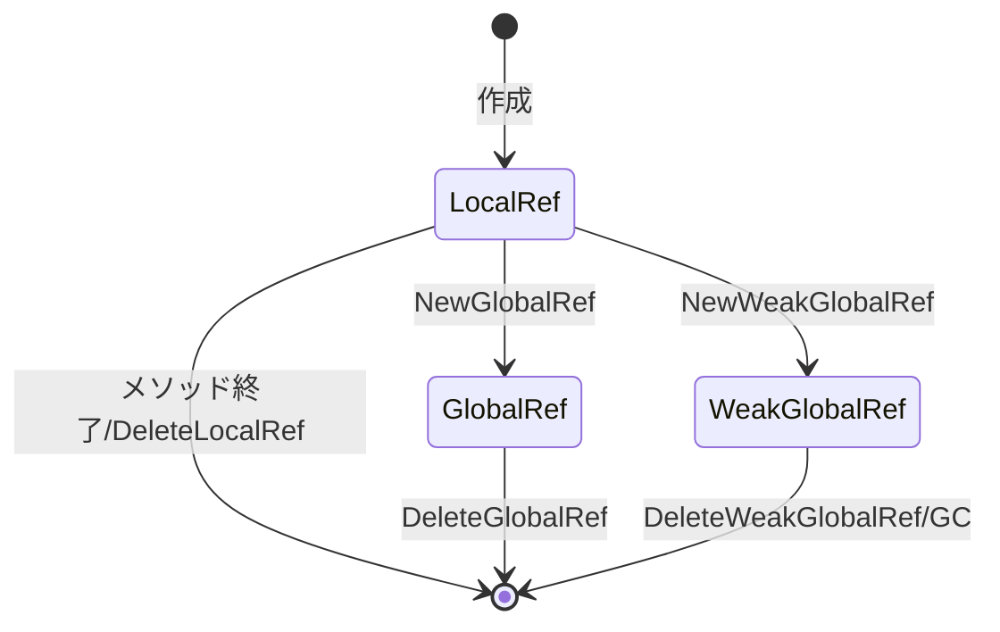
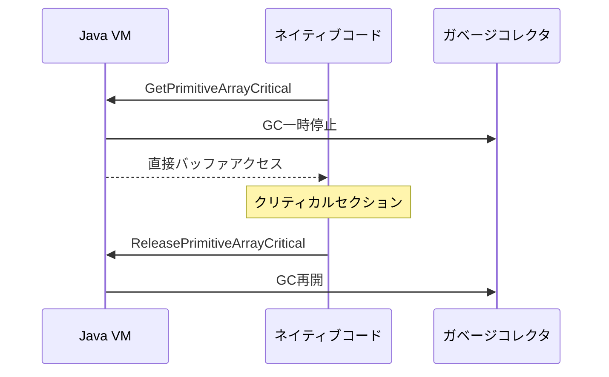
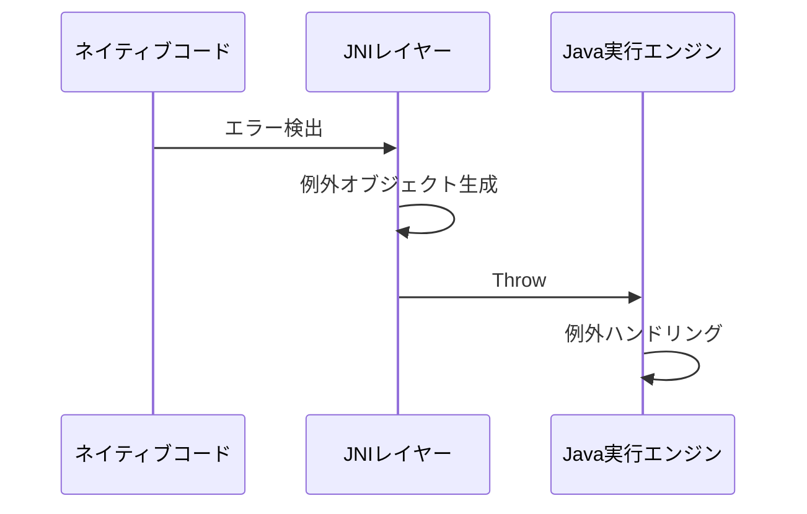

# ネイティブメソッドインターフェース（JNI）

## JNIの基本アーキテクチャ



## メソッド呼び出しシーケンス



## データ型マッピング

### プリミティブ型
- **jboolean**: uint8_t (unsigned char)
- **jbyte**: int8_t (signed char)
- **jchar**: uint16_t (unsigned short)
- **jshort**: int16_t (short)
- **jint**: int32_t (int)
- **jlong**: int64_t (long long)
- **jfloat**: float
- **jdouble**: double

### 参照型
- **jobject**: Javaオブジェクトへの参照
- **jclass**: Javaクラスへの参照
- **jstring**: Java文字列への参照
- **jarray**: 配列への参照
- **jthrowable**: 例外オブジェクトへの参照

## 参照管理

### 参照の種類
1. **ローカル参照**
   - メソッド呼び出し間のみ有効
   - 自動解放
   - `DeleteLocalRef`による明示的解放

2. **グローバル参照**
   - 明示的に解放するまで保持
   - `NewGlobalRef`で作成
   - `DeleteGlobalRef`で解放

3. **弱グローバル参照**
   - GC対象となる可能性あり
   - `NewWeakGlobalRef`で作成
   - `DeleteWeakGlobalRef`で解放



## メモリ管理

### クリティカルセクション


### リソース管理
1. **直接バッファ**
   - `NewDirectByteBuffer`
   - `GetDirectBufferAddress`
   - `GetDirectBufferCapacity`

2. **配列操作**
   - `Get<Type>ArrayElements`
   - `Release<Type>ArrayElements`
   - `Get<Type>ArrayRegion`
   - `Set<Type>ArrayRegion`

## エラー処理

### 例外処理フロー


### エラーチェック
1. **例外発生確認**
   - `ExceptionCheck`
   - `ExceptionOccurred`
   - `ExceptionDescribe`

2. **例外クリア**
   - `ExceptionClear`
   - 新規例外投げ直し

## セキュリティ考慮事項

### アクセス制御
1. **ネイティブメソッド登録**
   - シグネチャ検証
   - セキュリティマネージャーチェック

2. **リソースアクセス制限**
   - ファイルシステム
   - ネットワーク
   - システムリソース

### メモリ安全性
1. **バッファオーバーラン防止**
   - 境界チェック
   - サイズ検証

2. **リソースリーク防止**
   - 参照の適切な解放
   - クリティカルセクションの確実な終了

## 実装規約

### ネイティブメソッド命名
```java
JNIEXPORT <return_type> JNICALL Java_<完全修飾クラス名>_<メソッド名>
```

### エラー処理規約
```c
if ((*env)->ExceptionCheck(env)) {
    // エラー処理
    return;
}
```

### リソース管理規約
```c
void* critical_data = (*env)->GetPrimitiveArrayCritical(env, array, 0);
if (critical_data) {
    // 処理
    (*env)->ReleasePrimitiveArrayCritical(env, array, critical_data, 0);
}
```

## パフォーマンス考慮事項

### 最適化ポイント
1. **コピー削減**
   - 直接バッファの活用
   - クリティカルセクションの適切な使用

2. **参照管理の効率化**
   - 不要な参照の早期解放
   - キャッシュの活用

3. **型変換コスト**
   - バッチ処理の活用
   - ネイティブ型の適切な選択