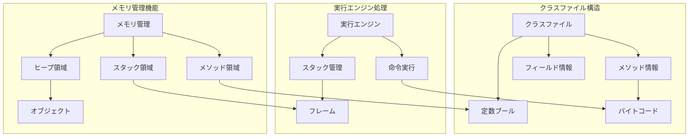
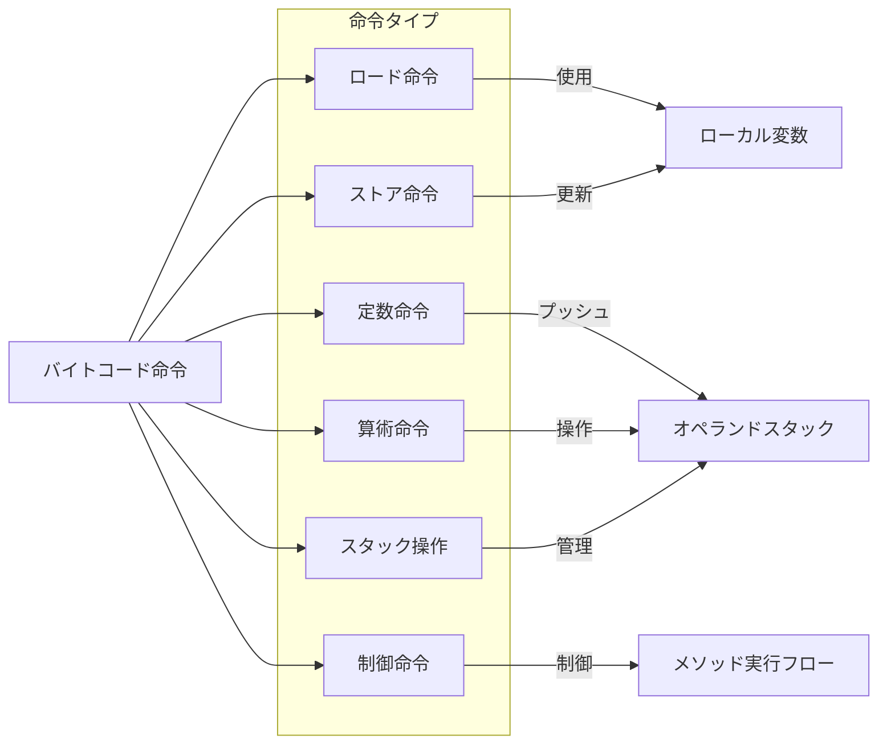
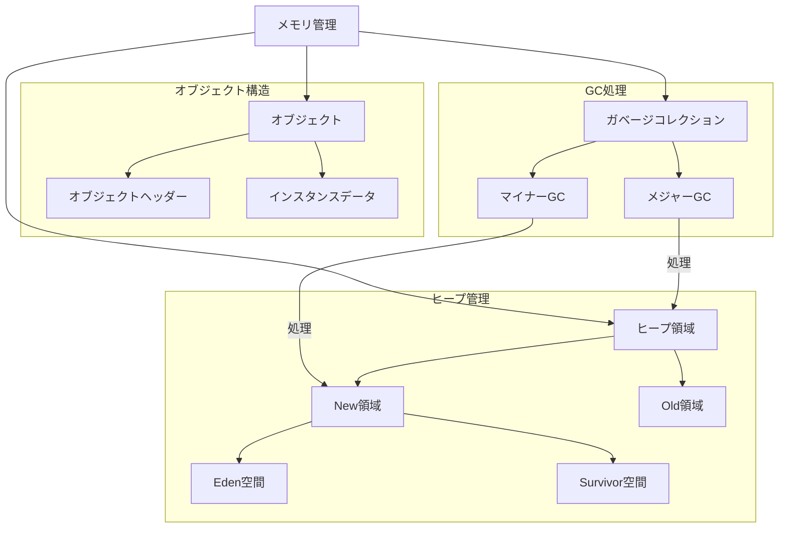
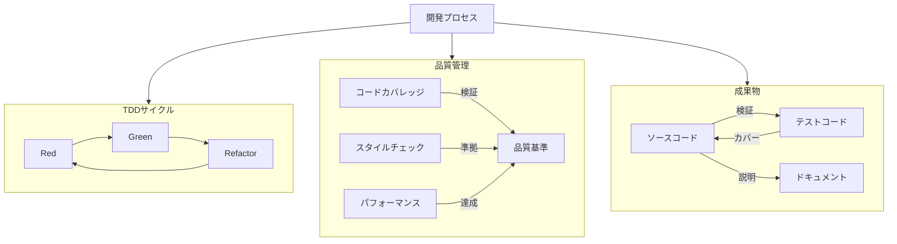

# 用語間の関係性マップ

## クラスファイル・実行エンジン・メモリの関係

## バイトコード命令の分類と関係

## メモリ領域の構造と相互作用

## 開発プロセスとコード品質の関係

## 用語の関係性の特徴

1. **階層的関係**
   - クラスファイル構造の階層
   - メモリ領域の階層
   - 命令セットの分類

2. **機能的関係**
   - バイトコード命令とスタック操作の関係
   - メモリ管理とオブジェクトライフサイクルの関係
   - 開発プロセスと品質管理の関係

3. **時間的関係**
   - クラスローディングから実行までのフロー
   - オブジェクトの生成から解放までのライフサイクル
   - TDDサイクルの繰り返し

4. **責任の境界**
   - クラスローダーの責任範囲
   - 実行エンジンの責任範囲
   - メモリ管理の責任範囲

## 注意点

1. **境界の明確化**
   - 各コンポーネント間の責任分担を明確に
   - インターフェースを通じた相互作用

2. **依存関係の管理**
   - 循環依存の回避
   - 適切な抽象化レベルの維持

3. **一貫性の確保**
   - 用語の統一的な使用
   - 命名規則の遵守